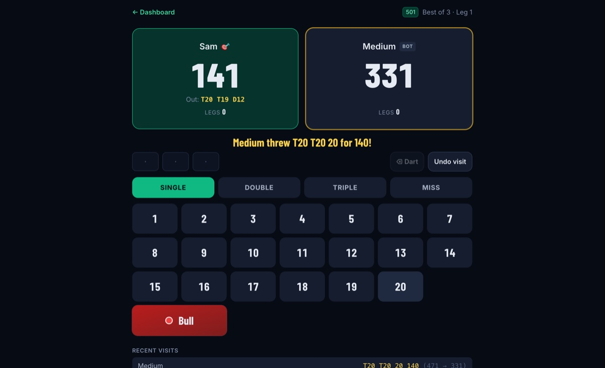
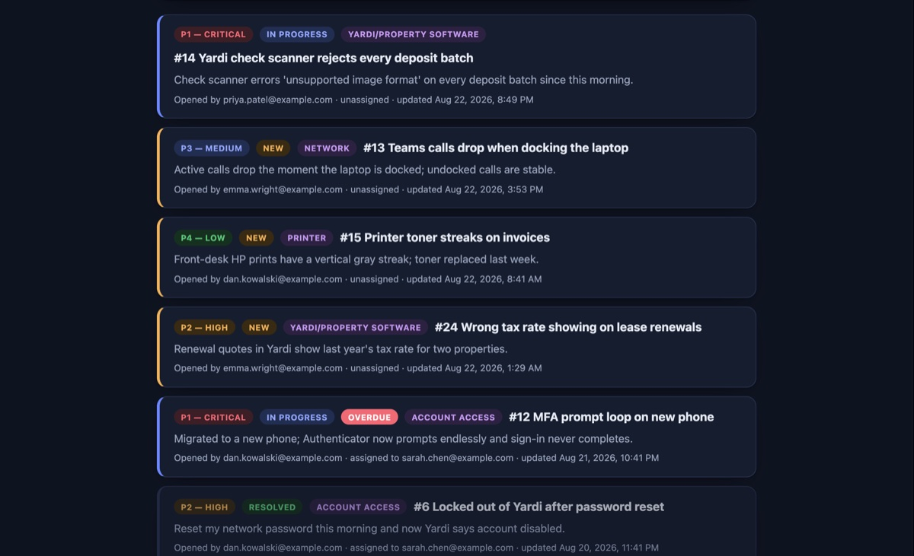

<picture>
  <source media="(prefers-color-scheme: dark)" srcset="assets/header-dark.svg">
  
</picture>

I'm a software engineer who automates the identity layer, and the infrastructure underneath it. Right now that
means automating Microsoft Entra ID onboarding and offboarding for 400+ users across
100+ properties at Habitat America with Python and the Microsoft Graph API, and
provisioning the app registrations, permissions, and secret storage those tools run
on as Terraform.

I also build and ship full-stack apps in React and FastAPI, with 700+ automated
tests and CI/CD behind them.

[pobriendev.github.io/portfolio](https://pobriendev.github.io/portfolio) · patobrien3590@gmail.com

---

### Built

**Identity and infrastructure**

- **[entra-terraform](https://github.com/pobriendev/entra-terraform)** — Terraform for the Entra ID identity layer the Graph tools below run on: app registration with least-privilege permissions and admin consent as code, a rotating secret in Key Vault, locked-down remote state. CI runs `terraform plan` on every PR over OIDC with a read-only identity and no stored credentials. The permissions that reset passwords and remove MFA methods sit behind a flag, off by default. 
- **[employee-provisioning-tool](https://github.com/pobriendev/employee-provisioning-tool)** — Python CLI that runs Entra ID onboarding/offboarding end to end: app-only auth, dry-run mode, lockout-first offboarding, and a full audit log so nothing happens silently. 
- **[entra-stale-accounts](https://github.com/pobriendev/entra-stale-accounts)** — `pip install entra-stale-accounts`. Read-only CLI that flags Entra ID accounts inactive past a set threshold, including ones that never signed in.  

**Full-stack apps**

<table>
  <tr>
    <td width="50%"></td>
    <td width="50%"></td>
  </tr>
  <tr>
    <td align="center"><b>DartMetrics</b> · <a href="https://dartmetrics.onrender.com">live demo</a> · <a href="https://github.com/pobriendev/dartmetrics">code</a></td>
    <td align="center"><b>Ticket system</b> · <a href="https://ticket-system-azure-omega.vercel.app">live demo</a> · <a href="https://github.com/pobriendev/ticket-system">code</a></td>
  </tr>
</table>

Both demos run on free tiers that sleep when idle, so the first load can take up to a minute.

- **[dartmetrics](https://github.com/pobriendev/dartmetrics)** — darts scoring platform (501, Cricket, Halve It) with a framework-free scoring engine and event-sourced stats — every dart is stored, nothing aggregated. 260+ backend tests plus Playwright end-to-end. [Live demo](https://dartmetrics.onrender.com). 
- **[ticket-system](https://github.com/pobriendev/ticket-system)** — helpdesk app, React/Vite + FastAPI + PostgreSQL, JWT auth, role-based access, full audit trail. 175+ backend tests (~96% coverage) and 125+ frontend tests. [Live demo](https://ticket-system-azure-omega.vercel.app). 
- **[ski-resort-explorer](https://github.com/pobriendev/ski-resort-explorer)** — React + Flask REST API serving 433 resorts from MySQL, with live weather and precipitation radar from OpenWeatherMap, proxied through Flask so the API key never reaches the browser.

<!-- next thing goes here -->

### Working with

<picture>
  <source media="(prefers-color-scheme: dark)" srcset="assets/stack-dark.svg">
  
</picture>
