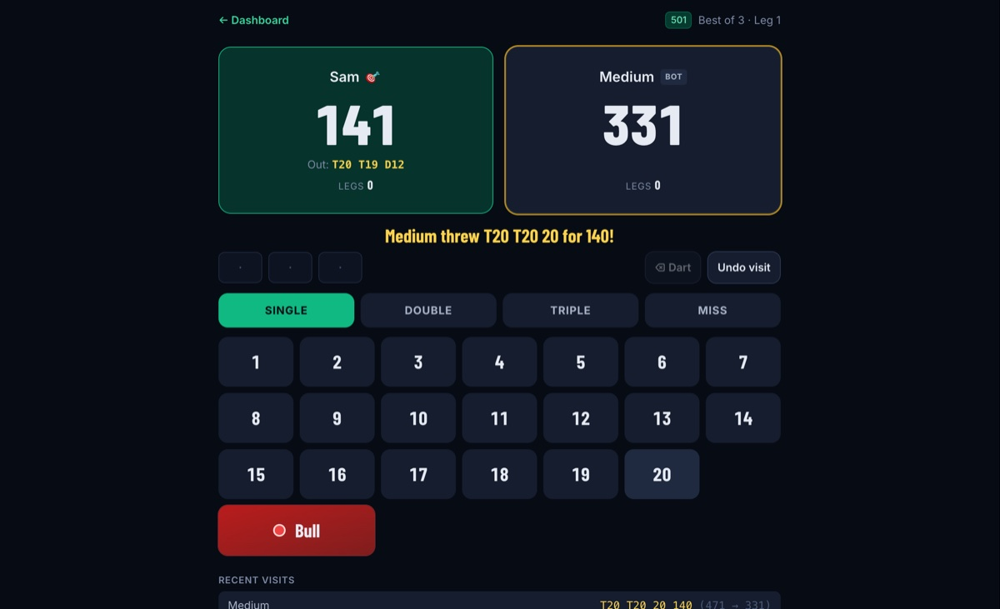
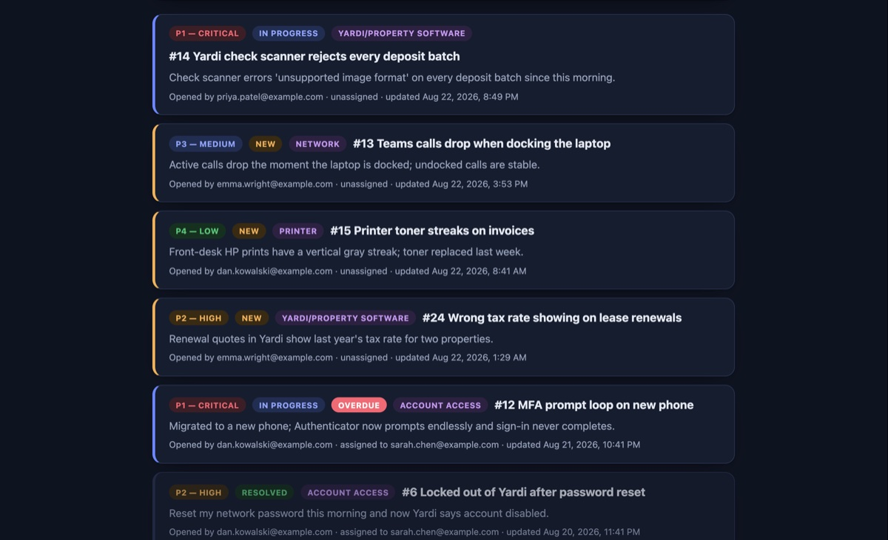

<picture>
  <source media="(prefers-color-scheme: dark)" srcset="assets/header-dark.svg">
  
</picture>

I'm a software engineer who automates the identity layer, and the infrastructure underneath it. Right now that
means automating Microsoft Entra ID onboarding and offboarding in a 400+-user, 100+-property
Microsoft 365 tenant with Python and the Microsoft Graph API. Separately, I codified that same
identity layer as Terraform in a personal sandbox tenant: the app registration, its Graph
permissions and consent, secret storage, and the CI that plans every change.

I also build and ship full-stack apps in React and FastAPI, both live, with CI/CD behind them.

[pobriendev.github.io/portfolio](https://pobriendev.github.io/portfolio) · patobrien3590@gmail.com

---

### Built

**Identity and infrastructure**

- **[entra-terraform](https://github.com/pobriendev/entra-terraform)** — Terraform that codifies, in a personal sandbox tenant, the identity layer the Graph tools below need: app registration with scoped Graph application permissions and admin consent as code, a 180-day client secret in Key Vault replaced on the next apply, and remote state with Entra-only auth and shared-key access disabled. CI runs `terraform plan` on every PR over OIDC with a CI identity that holds no Azure write roles, and no stored credentials. The permissions that reset passwords and remove MFA methods sit behind a flag, off by default. 
- **[employee-provisioning-tool](https://github.com/pobriendev/employee-provisioning-tool)** — Python CLI that runs the Graph side of Entra ID onboarding and offboarding in one command, and prints the remaining Exchange steps ready to paste: app-only auth for directory writes (operator sign-in only for email drafts and Exchange steps), dry-run mode, lockout-first offboarding, and an audit log of every completed write, tagged with who ran it. 
- **[entra-stale-accounts](https://github.com/pobriendev/entra-stale-accounts)** — `pip install entra-stale-accounts`. Read-only CLI that flags Entra ID accounts inactive past a set threshold, including ones that never signed in.  

**Full-stack apps**

<table>
  <tr>
    <td width="50%"></td>
    <td width="50%"></td>
  </tr>
  <tr>
    <td align="center"><b>DartMetrics</b> · <a href="https://dartmetrics.onrender.com">live demo</a> · <a href="https://github.com/pobriendev/dartmetrics">code</a></td>
    <td align="center"><b>Ticket system</b> · <a href="https://ticket-system-azure-omega.vercel.app">live demo</a> · <a href="https://github.com/pobriendev/ticket-system">code</a></td>
  </tr>
</table>

Both demos run on free tiers that sleep when idle, so the first load can take a minute or two.

- **[dartmetrics](https://github.com/pobriendev/dartmetrics)** — darts scoring platform (501, Cricket, Halve It) with a framework-free scoring engine. Every dart is stored individually; career stats (averages, checkout %, 180s) are derived from the raw darts, and a per-leg snapshot table caches live scoreboard state. 260+ backend tests plus Playwright end-to-end. [Live demo](https://dartmetrics.onrender.com). 
- **[ticket-system](https://github.com/pobriendev/ticket-system)** — helpdesk app, React/Vite + FastAPI + PostgreSQL, JWT auth, role-based access, and an audit log of every ticket field change. 175+ backend tests (~96% coverage, CI fails under 85%) and 125+ frontend tests. [Live demo](https://ticket-system-azure-omega.vercel.app). 
- **[ski-resort-explorer](https://github.com/pobriendev/ski-resort-explorer)** — React + Flask REST API serving 423 resorts from MySQL, with live weather and precipitation radar from OpenWeatherMap, proxied through Flask so the API key never reaches the browser.

<!-- next thing goes here -->

### Working with

<picture>
  <source media="(prefers-color-scheme: dark)" srcset="assets/stack-dark.svg">
  
</picture>
